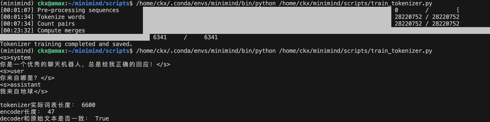

# 记录训练kxgpt

## 1、训练tokenizer
- 使用ByteLevel-bpe算法
- 词表大小6600
- 特殊token ["<unk>", "<s>", "</s>"]
- 耗时约：30min



## 2、预训练（dense，类似llama3架构）
- llama3特殊点： RoPE、swiglu激活函数、mlp中的门控机制
```
输入 x
│
├─> w1(x) ──> silu ─┐
│                   × ──> w2 ──> dropout ──> 输出
└─> w3(x) ─────────┘
```
```
模型架构超参数：
        dim: int = 512,
        n_layers: int = 8,
        n_heads: int = 8,
        n_kv_heads: int = 2,
        vocab_size: int = 6600,
        hidden_dim: int = None,
        multiple_of: int = 64,
        norm_eps: float = 1e-5,
        max_seq_len: int = 8192,
        rope_theta: int = 1e6,
        dropout: float = 0.0,
        flash_attn: bool = True,
```
- 训练了4个epoch
- 总参数量：25.932 百万
- 耗时：161min

## 3、分阶段sft
- 第一阶段Full SFT 数据的seq_length = 512  路径 ./minimind/dataset/sft_512.jsonl 
- batchsize：32 耗时：192min
- 第一阶段Full SFT 数据的seq_length = 2048  路径 ./minimind/dataset/sft_2048.jsonl
- batchsize: 32 耗时：13.8h

## 4、dpo
- Full RLHF 数据路径：./dataset/dpo.jsonl
- sft阶段学习率为 「5e-6」->「5e-7」长度512，建议离线正负样本「概率」偏好对齐阶段lr <=「1e-8」长度3000，否则很容易遗忘训坏
- batchsize：8 耗时：